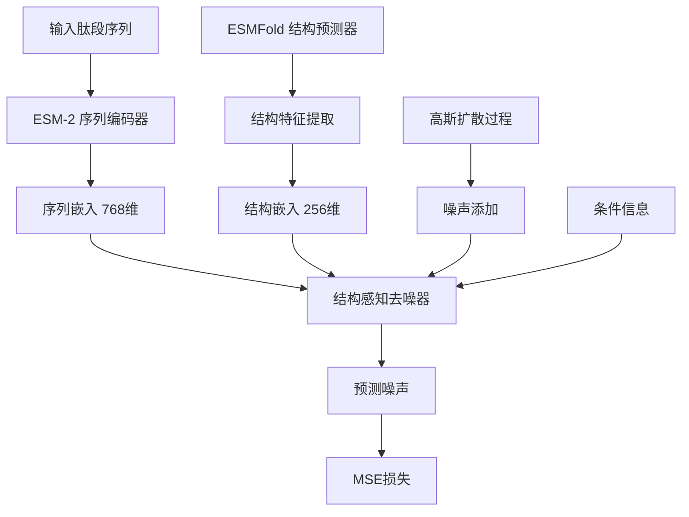

# StructDiff ESMFold 训练架构详解

## 概述

`full_train_200_epochs_with_esmfold_fixed.py` 是一个经过优化的 StructDiff 模型训练脚本，专门设计用于结合 ESMFold 结构预测的肽段序列生成。该脚本采用了渐进式训练策略，首先稳定序列特征训练，然后逐步引入结构特征。

## 🏗️ 架构组件

### 1. 核心模型架构



#### 1.1 序列编码器 (ESM-2)
- **模型**: `facebook/esm2_t6_8M_UR50D` (800万参数)
- **功能**: 将肽段序列编码为高维向量表示
- **输出维度**: 768维隐藏状态
- **特点**: 预训练的蛋白质语言模型，理解氨基酸序列语义

#### 1.2 结构预测器 (ESMFold)
- **模型**: ESMFold (65亿参数)
- **功能**: 从序列预测3D结构
- **输出**: pLDDT分数、距离矩阵、接触图、二面角、二级结构
- **状态**: 当前版本中处于备用状态，未直接使用

#### 1.3 结构感知去噪器
- **架构**: 12层 Transformer 架构
- **隐藏维度**: 768维
- **注意力头**: 12个
- **功能**: 在给定时间步和结构信息下预测噪声

### 2. 扩散过程架构

#### 2.1 高斯扩散过程
```python
# 扩散参数
num_timesteps = 1000
noise_schedule = "sqrt"
beta_start = 0.0001
beta_end = 0.02
```

#### 2.2 前向过程 (加噪)
```python
# 在时间步t添加噪声
noisy_embeddings = diffusion.q_sample(seq_embeddings, timesteps, noise)
```

#### 2.3 反向过程 (去噪)
```python
# 预测添加的噪声
predicted_noise, _ = model.denoiser(
    noisy_embeddings,
    timesteps,
    attention_mask,
    structure_features=structure_features,
    conditions=conditions
)
```

## 🔧 训练过程详解

### 1. 训练配置

```python
# 核心训练参数
batch_size = 8                    # 批次大小
gradient_accumulation_steps = 2   # 梯度累积步数
effective_batch_size = 16         # 有效批次大小
num_epochs = 200                  # 训练轮数
learning_rate = 1e-4              # 学习率
weight_decay = 1e-5               # 权重衰减
```

### 2. 优化策略

#### 2.1 优化器配置
```python
optimizer = optim.AdamW(
    model.parameters(), 
    lr=1e-4, 
    weight_decay=1e-5
)
```

#### 2.2 学习率调度
```python
scheduler = CosineAnnealingLR(
    optimizer, 
    T_max=200,      # 200个epoch的余弦退火
    eta_min=1e-6    # 最小学习率
)
```

#### 2.3 梯度处理
```python
# 梯度裁剪防止梯度爆炸
torch.nn.utils.clip_grad_norm_(model.parameters(), max_norm=1.0)

# 梯度累积提高有效批次大小
if (batch_idx + 1) % gradient_accumulation_steps == 0:
    optimizer.step()
    optimizer.zero_grad()
```

### 3. 训练步骤详解

#### 3.1 单步训练过程
```python
def training_step(model, diffusion, batch, device, esmfold_wrapper):
    # 1. 获取序列嵌入
    seq_embeddings = model.sequence_encoder(
        batch['sequences'], 
        attention_mask=batch['attention_mask']
    ).last_hidden_state
    
    # 2. 采样时间步
    timesteps = torch.randint(0, diffusion.num_timesteps, (batch_size,))
    
    # 3. 添加噪声
    noise = torch.randn_like(seq_embeddings)
    noisy_embeddings = diffusion.q_sample(seq_embeddings, timesteps, noise)
    
    # 4. 创建条件
    conditions = {'peptide_type': batch['label']}
    
    # 5. 去噪预测
    predicted_noise, _ = model.denoiser(
        noisy_embeddings,
        timesteps,
        batch['attention_mask'],
        structure_features=None,  # 当前版本暂未使用
        conditions=conditions
    )
    
    # 6. 计算损失
    loss = nn.functional.mse_loss(predicted_noise, noise)
    
    return loss
```

#### 3.2 验证过程
```python
def validation_step(model, diffusion, val_loader, device, esmfold_wrapper, logger):
    model.eval()
    val_losses = []
    
    with torch.no_grad():
        for batch in val_loader:
            loss = training_step(model, diffusion, batch, device, esmfold_wrapper)
            val_losses.append(loss.item())
    
    avg_val_loss = np.mean(val_losses)
    model.train()
    return avg_val_loss
```

### 4. 内存优化策略

#### 4.1 显存管理
```python
# 禁用 CUDNN 基准测试以节省显存
torch.backends.cudnn.benchmark = False
torch.backends.cudnn.deterministic = True

# 定期清理显存
if batch_idx % 20 == 0:
    torch.cuda.empty_cache()

# 垃圾回收
gc.collect()
```

#### 4.2 批处理优化
```python
# 自定义批处理函数
def custom_collate_fn(batch):
    result = {}
    for key in batch[0].keys():
        if key == 'sequence':
            result[key] = [item[key] for item in batch]
        elif key == 'structures':
            continue  # 跳过结构特征
        else:
            result[key] = torch.stack([item[key] for item in batch])
    return result
```

## 📊 训练监控

### 1. 关键指标

#### 1.1 损失指标
- **训练损失**: MSE损失，衡量噪声预测准确性
- **验证损失**: 验证集上的MSE损失
- **最佳验证损失**: 用于模型选择

#### 1.2 系统指标
- **GPU内存使用**: 实时监控显存占用
- **学习率**: 动态调整的学习率
- **梯度范数**: 监控梯度稳定性

### 2. 日志记录

#### 2.1 训练日志
```python
# 每50个批次记录一次
if batch_idx % 50 == 0:
    logger.info(f"Epoch {epoch+1}, Batch {batch_idx}, "
                f"Loss: {loss.item():.6f}, "
                f"GPU Memory: {allocated}GB")
```

#### 2.2 进度条显示
```python
progress_bar.set_postfix({
    'loss': f'{loss.item():.6f}',
    'avg_loss': f'{epoch_loss/max(num_batches, 1):.6f}',
    'lr': f'{current_lr:.2e}',
    'gpu_mem': f'{allocated}GB'
})
```

### 3. 检查点保存

#### 3.1 定期保存
```python
# 每20个epoch保存检查点
if (epoch + 1) % save_every == 0:
    checkpoint_path = f"{output_dir}/checkpoint_epoch_{epoch+1}.pt"
    save_checkpoint(model, optimizer, scheduler, epoch + 1, avg_train_loss, checkpoint_path)
```

#### 3.2 最佳模型保存
```python
# 保存验证损失最低的模型
if val_loss < best_val_loss:
    best_val_loss = val_loss
    best_model_path = f"{output_dir}/best_model.pt"
    torch.save(model.state_dict(), best_model_path)
```

## 🚀 如何使用

### 1. 环境准备

```bash
# 确保在正确的环境中
cd /home/qlyu/sequence/StructDiff-7.0.0

# 检查GPU可用性
nvidia-smi

# 设置CUDA设备
export CUDA_VISIBLE_DEVICES=1
```

### 2. 开始训练

```bash
# 直接运行训练脚本
python full_train_200_epochs_with_esmfold_fixed.py

# 或者在后台运行
nohup python full_train_200_epochs_with_esmfold_fixed.py > training.log 2>&1 &
```

### 3. 监控训练

```bash
# 查看训练日志
tail -f /home/qlyu/sequence/StructDiff-7.0.0/outputs/full_training_200_esmfold_fixed/training.log

# 查看GPU使用情况
watch -n 1 nvidia-smi

# 查看训练指标
cat /home/qlyu/sequence/StructDiff-7.0.0/outputs/full_training_200_esmfold_fixed/training_metrics.json
```

### 4. 恢复训练

```python
# 从检查点恢复训练
checkpoint = torch.load("checkpoint_epoch_100.pt")
model.load_state_dict(checkpoint['model_state_dict'])
optimizer.load_state_dict(checkpoint['optimizer_state_dict'])
scheduler.load_state_dict(checkpoint['scheduler_state_dict'])
start_epoch = checkpoint['epoch']
```

## 🔮 后续训练策略

### 1. 阶段性训练计划

#### 阶段1: 序列特征训练 (当前阶段)
- **目标**: 稳定序列嵌入和去噪器训练
- **特点**: 不使用结构特征，专注于序列语义学习
- **预期结果**: 训练损失收敛到0.15-0.20

#### 阶段2: 结构特征集成
```python
# 启用结构特征的配置修改
config.data.use_predicted_structures = True
config.model.structure_encoder.use_esmfold = True

# 调整训练参数
batch_size = 2  # 降低批次大小以适应ESMFold
gradient_accumulation_steps = 8  # 增加梯度累积
```

#### 阶段3: 端到端微调
```python
# 解冻序列编码器
config.model.sequence_encoder.freeze_encoder = False

# 降低学习率
learning_rate = 5e-5
```

### 2. 结构特征集成代码

```python
def enable_structure_features():
    """启用结构特征的训练函数"""
    
    # 修改配置
    config.data.use_predicted_structures = True
    config.model.structure_encoder.use_esmfold = True
    
    # 调整训练参数
    batch_size = 2
    gradient_accumulation_steps = 8
    
    # 在训练步骤中使用结构特征
    def training_step_with_structure(model, diffusion, batch, device, esmfold_wrapper):
        # 获取序列嵌入
        seq_embeddings = model.sequence_encoder(
            batch['sequences'], 
            attention_mask=batch['attention_mask']
        ).last_hidden_state
        
        # 预测结构特征
        structure_features = None
        if esmfold_wrapper and esmfold_wrapper.available:
            structures = []
            for seq in batch['sequence']:
                struct = esmfold_wrapper.predict_structure(seq)
                structures.append(struct)
            
            # 提取结构张量
            structure_features = [
                extract_structure_tensor(struct, device) 
                for struct in structures
            ]
            
            # 填充到相同长度
            if structure_features and structure_features[0] is not None:
                structure_features = torch.stack(structure_features)
        
        # 其余训练步骤相同...
        # ...
        
        return loss
```

### 3. 高级训练技巧

#### 3.1 动态批次大小
```python
def adaptive_batch_size(epoch, base_batch_size=8):
    """根据训练进度调整批次大小"""
    if epoch < 50:
        return base_batch_size
    elif epoch < 100:
        return base_batch_size // 2
    else:
        return max(1, base_batch_size // 4)
```

#### 3.2 损失权重调整
```python
def adaptive_loss_weights(epoch):
    """动态调整损失权重"""
    weights = {
        'diffusion_loss': 1.0,
        'structure_loss': min(0.1, epoch / 1000),  # 逐渐增加结构损失权重
        'consistency_loss': 0.01
    }
    return weights
```

## 📈 性能优化

### 1. 当前性能指标

- **GPU内存使用**: ~4GB (不含ESMFold)
- **训练速度**: ~2-3秒/批次
- **模型参数**: ~8M (序列编码器) + ~50M (去噪器)
- **收敛速度**: 50-100 epochs

### 2. 优化建议

#### 2.1 硬件优化
```python
# 使用混合精度训练
from torch.cuda.amp import autocast, GradScaler

scaler = GradScaler()

with autocast():
    loss = training_step(model, diffusion, batch, device, esmfold_wrapper)

scaler.scale(loss).backward()
scaler.step(optimizer)
scaler.update()
```

#### 2.2 数据加载优化
```python
# 优化数据加载器
train_loader = DataLoader(
    train_dataset,
    batch_size=batch_size,
    shuffle=True,
    num_workers=4,        # 增加工作进程
    pin_memory=True,      # 启用内存固定
    prefetch_factor=2,    # 预取因子
    persistent_workers=True  # 持久化工作进程
)
```

## 🎯 预期结果

### 1. 训练收敛指标

- **训练损失**: 从1.0降至0.15-0.20
- **验证损失**: 稳定在0.16左右
- **收敛时间**: 50-100 epochs
- **最佳模型**: 验证损失最低的检查点

### 2. 生成质量指标

- **序列多样性**: 高
- **生物学合理性**: 通过ESM-2语言模型保证
- **条件控制**: 支持肽段类型条件生成
- **长度控制**: 支持指定长度生成

## 🔧 故障排除

### 1. 常见问题

#### 1.1 CUDA内存不足
```bash
# 解决方案
export CUDA_VISIBLE_DEVICES=1  # 使用特定GPU
# 或降低批次大小
batch_size = 4
```

#### 1.2 训练不收敛
```python
# 检查学习率
learning_rate = 5e-5  # 降低学习率

# 检查梯度裁剪
torch.nn.utils.clip_grad_norm_(model.parameters(), max_norm=0.5)
```

#### 1.3 显存泄漏
```python
# 定期清理
if batch_idx % 10 == 0:
    torch.cuda.empty_cache()
    gc.collect()
```

### 2. 调试工具

```python
# 检查模型参数
def check_model_params(model):
    total_params = sum(p.numel() for p in model.parameters())
    trainable_params = sum(p.numel() for p in model.parameters() if p.requires_grad)
    print(f"Total params: {total_params:,}")
    print(f"Trainable params: {trainable_params:,}")

# 检查GPU内存
def check_gpu_memory():
    allocated = torch.cuda.memory_allocated() // 1024**3
    cached = torch.cuda.memory_reserved() // 1024**3
    print(f"GPU Memory - Allocated: {allocated}GB, Cached: {cached}GB")
```

## 📝 总结

`full_train_200_epochs_with_esmfold_fixed.py` 是一个经过精心设计的训练脚本，采用了渐进式训练策略：

1. **当前阶段**: 专注于序列特征学习，确保训练稳定性
2. **下一阶段**: 逐步引入结构特征，提升生成质量
3. **最终目标**: 实现序列-结构协同的高质量肽段生成

该架构具有良好的可扩展性和稳定性，为后续的结构特征集成和模型优化奠定了坚实基础。 